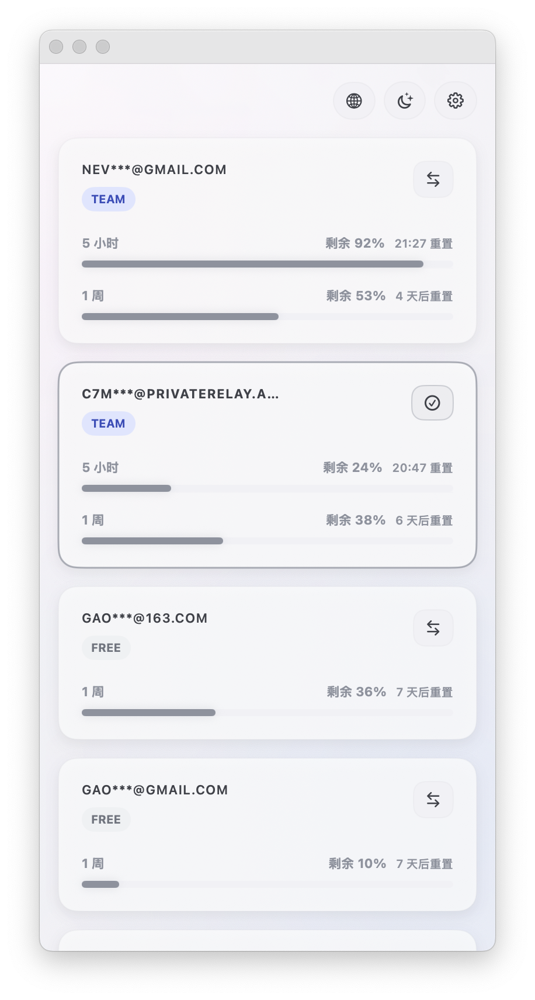

# codex-app-switcher

A macOS utility to quickly switch Codex accounts and launch Codex.

<p align="center">
  
</p>

## What It Does

- Keeps a local list of Codex accounts and lets you switch between them.
- Launches or relaunches the Codex desktop app after switching.
- Tracks 5-hour and 1-week usage windows for each account.
- Supports signing in a new account, importing/exporting account JSON, and clearing saved accounts.
- Supports Chinese and English UI, plus light and dark themes.

## UI Notes

- On launch, the account list is rendered from local storage first; usage refresh runs in the background so the window is usable immediately.
- Toolbar and row actions are icon-first. Labels appear on hover.
- Double-click an email to temporarily reveal the full address instead of the masked version.

## Quick Start

Requirements:

- macOS
- Xcode

Open the project in Xcode:

```bash
open ./codex-app-switcher.xcodeproj
```

Build the `.app` from the repository root:

```bash
./scripts/package-app.sh
```

Build output:

```bash
./dist/codex-app-switcher.app
```

Launch:

```bash
open ./dist/codex-app-switcher.app
```

## Privacy Guard (Recommended)

Install the built-in `pre-commit` hook to scan staged files for common secrets before commit:

```bash
./scripts/install-git-hooks.sh
```

If a commit is blocked, unstage suspicious files first:

```bash
git restore --staged <file>
```
